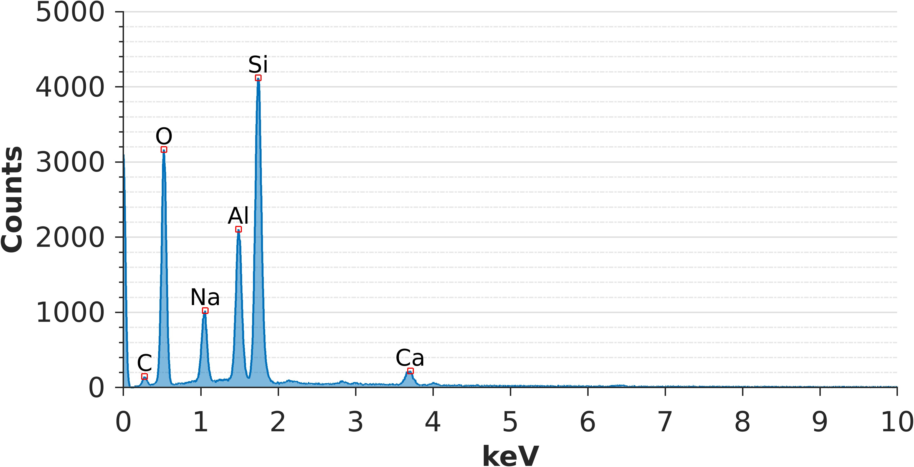

# Summary
Mineral dust plays an important role in governing Earth's energy balance and also accelerates the melting of glaciers. The most common analytical method for studying mineral dust is scanning electron microscopy (SEM) with energy dispersive x-ray spectrometry (EDS). The primary benefit of SEM-EDS over alternative techniques is that it allows researchers to select and measure the elemental compositions of individual particles. However, elemental composition alone is often not enough to confidently infer mineralogy because many unrelated minerals are comprised of the same elements. Identifying minerals from SEM-EDS data has also historically been a labor intensive task because automated procedures are not readily available. To address these limitations, a repository of MATLAB functions has been assembled to work with SEM-EDS data, with the objective of providing researchers with tools to quickly and accurately determine the mineral compositions of dust particles. The repository includes a machine learning classifier and three additional sorting algorithms that have been transcribed from the peer-reviewed literature, as well as functions for importing and visualizing x-ray energy spectra.

# Statement of need
The mineral classification of single particles (i.e., dust) has major implications for atmospheric and glaciological research. For instance, there is a great need for building mineral dust datasets that can be used to improve the predictive ability of climate models [@Elements2010]. Mineral dust observations are also severely limited in many glaciated mountain regions, meaning that the dust's radiative impact on glacier melt rates cannot be easily determined [@Gilardoni2022].

One of the most common methods for reconstructing the mineral dust history of a location or region has been the use of scanning electron microscopy with energy dispersive x-ray spectrometry (SEM-EDS) to analyze single particles extracted from ice cores [@Donarummo2003; @Wu2016; @Nagatsuka2021]. SEM allows researchers to examine particles individually while an EDS detector measures the particles' elemental compositions as they emit x-rays under the influence of an electron beam. However, the process of classifying single particles from EDS data is highly laborious and prone to error due to the complexity of certain minerals' elemental signatures. The adoption of numerous classification techniques is typically required to improve the certainty of the classifications before finalizing the results. Many have used the dichotomous key in @Severin2004 to compare EDS spectra to that of mineral standards, but this protocol requires access to a physical or digital copy of the book and cannot be automated. Others have used published sorting algorithms like the one by @Donarummo2003, but these algorithms are limited in the number of minerals that they can identify and, to the author's knowledge, each of these algorithms is only available in print and not as a functional computer program. 

Therefore, to satisfy the needs of Earth and atmospheric scientists seeking to rapidly classify mineral particles from EDS data with a high degree of certainty, an open-source repository of functions for implementing different mineral classification algorithms has been developed for MATLAB (along with several homologous functions written in the Julia programming language). This library of functions gives users the tools to work with SEM-EDS data and to perform mineral classification with ease.

# Methods
## Mineral Dust Classification

The function library introduces a supervised machine learning model (the "Weber algorithm") that is trained to recognize 18 common minerals from EDS net intensity data and exhibits an overall accuracy exceeding 99% (see **[Supplemental Information](https://github.com/weber1158/eds-classification/blob/902b82aa5b984983c448366cbf4794b62273d765/Paper/supplement.md)**). The library also includes functions for three non-machine learning algorithms that have been painstakingly transcribed from the literature into MATLAB and Julia code. This includes the sorting algorithm from @Donarummo2003 which can be used to classify 16 unique aluminosilicate minerals based on EDS net intensity data, the Panta algorithm [@Panta2023] which can be used to classify 17 unique minerals and 6 mineral groups based on EDS atom percent data, and the Kandler algorithm [@Kandler2011] which can be used to categorize EDS atom percent data into broad mineral groups, classes, and refractive indexes. 

The four mineral classification algorithms are available as individual functions (`weber_classification`, `donarummo_classifiation`,  `panta_classifiation`, and `kandler_classification`) as well as packaged together in a single function (`eds_classification`). Each function has clearly written documentation that can be viewed using the MATLAB `help` or `doc` commands. The general syntax, however, is very basic:

```matlab
minerals = eds_classifiation(data,Algorithm="Name")
```

where `data` is a table of EDS data and `"Name"` specifies the desired algorithm; i.e., `"Weber"` (default), `"Donarummo"`, `"Kandler"`, or `"Panta"`. The output `minerals` is a categorical vector containing the mineral assignments for each row in the input table.

## Visualizing EDS Spectra

For individuals who want to compare the EDS spectra of their single particle measurements to the standard spectra in @Severin2004, it will be necessary to visualize each energy spectrum along with labels for the major characteristic x-rays. Most EDS software save x-ray energy data in the EMSA (`.msa`) file format which is compiled differently depending on the software and therefore makes it difficult to simply import the data using a base MATLAB function such as `readtable`. While methods for visualizing  EDS spectra are available for the Julia programming language [@Ritchie2022] and as a desktop Java application (see **[DTSA-II](https://www.cstl.nist.gov/div837/837.02/epq/dtsa2/index.html)**), there are currently no simple alternatives to perform these tasks in MATLAB. 

To address this limitation, the EDS mineral dust classification library also provides functions for importing `.msa` files into MATLAB and for visualizing the EDS spectrum contained in a file. Just use the `xray_plot` function to view the spectrum and the `xray_peak_label` function to label the characteristic x-rays with the most likely element (**Fig.1**).

```matlab
plt = xray_plot('spectrum.msa');
xray_peak_label(plt)
```



# Acknowledgements

I thank Paul Pohwat and the Smithsonian Institution for contributing the mineral standards used in this project. I also thank my graduate advisor Lonnie Thompson for his continued support, as well as Dan Veghte, Julia Sheets, Ian Howat, Joachim Moortgat, and Steven Quiring for their teaching and advise. Lastly, I thank Lijia Wei for her internal review of the software. The electron microscopy work used to train the machine learning model was performed at the Center for Electron Microcscopy and Analysis (CEMAS) in the College of Engineering at The Ohio State University. Additional electron microscopy was carried out at the Subsurface Energy Materials Characterization and Analysis Laboratory (SEMCAL) in the School of Earth Sciences at The Ohio State University.

# Copyrights

The software repository is made available under a MIT license, meaning that users are free to modify and distribute the software without restriction. However, the *intellectual copyrights* for the Donarummo, Kandler, and Panta algorithms belong to their original creators. If you use any of these algorithms in your research, **please** also cite the original references as appropriate.

# References

